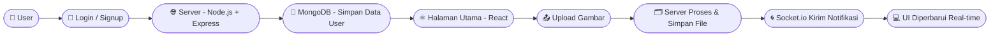

<h1 align="center">💬 makeAconv</h1>

  Aplikasi web interaktif untuk berbagi dan mengonversi file dengan fitur real-time berbasis <b>React</b>, <b>Node.js</b>, dan <b>Socket.io</b>.
   
  Dibuat oleh <b>Rafif Syandana</b>

---

  
  
  
  
  
  

---

## 🚀 Tentang Proyek

**makeAconv** adalah aplikasi web yang memungkinkan pengguna:
- 🔐 Membuat akun dan login secara aman  
- 🧑‍💼 Mengelola profil & foto pengguna  
- 📤 Mengunggah gambar dan file  
- 🟢 Melihat status online/offline secara real-time  
- 🔔 Menerima notifikasi langsung  
- 🗂️ Mengakses daftar kontak dari pengguna lain  

Aplikasi ini dibangun untuk menonjolkan **interaksi pengguna secara real-time** dan **desain yang modern** menggunakan teknologi web terkini.

---

## 🧠 Teknologi yang Digunakan

| Teknologi | Fungsi |
|------------|--------|
| ⚛️ **React.js** | Membangun UI yang dinamis dan modular |
| 🎨 **Tailwind CSS** | Styling cepat dan responsif |
| 🟩 **Node.js + Express.js** | Backend dan REST API |
| 🌀 **Socket.io** | Komunikasi real-time |
| 🍃 **MongoDB** | Database utama untuk data user & kontak |
| ☁️ **Sevalla** | Deployment & hosting online |

---

## 🔄 Alur Proses Aplikasi

---

## ⚙️ Cara Menjalankan Proyek (Local)
# 1️⃣ Clone repository
git clone https://github.com/drexjgobgt/makeAconv.git

cd makeAconv

# 2️⃣ Install dependencies
npm install

# 3️⃣ Jalankan server backend
cd backend

npm run dec

# 4️⃣ Jalankan frontend React
cd ../frontend
npm run dev

## 👨‍💻 Pengembang

Rafif Syandana
💡 Mahasiswa dan web developer yang fokus pada aplikasi interaktif berbasis JavaScript & Node.js.

## 📜 Lisensi
Proyek ini bersifat open source dan dapat digunakan untuk pembelajaran atau pengembangan pribadi.

 <b>✨ makeAconv — Real-time Communication Made Simple ✨</b> 

