<h1 align="center">💬 makeAconv</h1>

<p align="center">
  Aplikasi web interaktif untuk berbagi dan mengonversi file dengan fitur real-time berbasis <b>React</b>, <b>Node.js</b>, dan <b>Socket.io</b>.
  <br/>
  <sub>Dibuat oleh <b>Rafif Syandana</b></sub>
</p>

---

<p align="center">
  
  
  
  
  
  
</p>

---

## 🚀 Tentang Proyek

- 🔐 Custom JWT Authentication (no 3rd-party auth)
- ⚡ Real-time Messaging via Socket.io
- 🟢 Online/Offline Presence Indicators
- 🔔 Notification & Typing Sounds (with toggle)
- 📨 Welcome Emails on Signup (Resend)
- 🗂️ Image Uploads (Cloudinary)
- 🧰 REST API with Node.js & Express
- 🧱 MongoDB for Data Persistence
- 🚦 API Rate-Limiting powered by Arcjet
- 🎨 Beautiful UI with React, Tailwind CSS & DaisyUI
- 🧠 Zustand for State Management
- 🧑‍💻 Git & GitHub Workflow (branches, PRs, merges)
- 🚀 Easy Deployment (free-tier friendly with Sevalla)

Aplikasi ini dibangun untuk menonjolkan **interaksi pengguna secara real-time** dan **desain yang modern** menggunakan teknologi web terkini.

---

## 🧠 Teknologi yang Digunakan

| Teknologi | Fungsi |
|------------|--------|
| ⚛️ **React.js** | Membangun UI yang dinamis dan modular |
| 🎨 **Tailwind CSS** | Styling cepat dan responsif |
| 🟩 **Node.js + Express.js** | Backend dan REST API |
| 🌀 **Socket.io** | Komunikasi real-time |
| 🍃 **MongoDB** | Database utama untuk data user & kontak |
| ☁️ **Sevalla** | Deployment & hosting online |

---

## 🔄 Alur Proses Aplikasi

```mermaid
flowchart LR
    A([👤 User]) --> B([🔐 Login / Signup])
    B --> C([🌐 Server - Node.js + Express])
    C --> D([🍃 MongoDB - Simpan Data User])
    D --> E([⚛️ Halaman Utama - React])
    E --> F([📤 Upload Gambar])
    F --> G([🗂️ Server Proses & Simpan File])
    G --> H([🌀 Socket.io Kirim Notifikasi])
    H --> I([💻 UI Diperbarui Real-time])
```



---

## 🧪 .env Setup

### Backend (`/backend`)

```bash
PORT=3000
MONGO_URI=your_mongo_uri_here

NODE_ENV=development

JWT_SECRET=your_jwt_secret

RESEND_API_KEY=your_resend_api_key
EMAIL_FROM=your_email_from_address
EMAIL_FROM_NAME=your_email_from_name

CLIENT_URL=http://localhost:5173

CLOUDINARY_CLOUD_NAME=your_cloudinary_cloud_name
CLOUDINARY_API_KEY=your_cloudinary_api_key
CLOUDINARY_API_SECRET=your_cloudinary_api_secret

ARCJET_KEY=your_arcjet_key
ARCJET_ENV=development
```

---

## ⚙️ Cara Menjalankan Proyek (Local)
# 1️⃣ Clone repository
git clone https://github.com/drexjgobgt/makeAconv.git

cd makeAconv

# 2️⃣ Install dependencies
npm install

# 3️⃣ Jalankan server backend
cd backend

npm run dec

# 4️⃣ Jalankan frontend React
cd ../frontend
npm run dev

## 👨‍💻 Pengembang

Rafif Syandana
💡 Mahasiswa dan web developer yang fokus pada aplikasi interaktif berbasis JavaScript & Node.js.

## 📜 Lisensi
Proyek ini bersifat open source dan dapat digunakan untuk pembelajaran atau pengembangan pribadi.

<p align="center"> <b>✨ makeAconv — Real-time Communication Made Simple ✨</b> </p>
